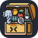

  

  
   
  <!--  -->
  
  
  
  
  
  
  
  

  
   
  
  
  <picture>
  	<source media="(prefers-color-scheme: dark)" srcset="./assets/projects/fit-dark.svg">
    <source media="(prefers-color-scheme: light)" srcset="./assets/projects/fit.svg">
    
  </picture>

